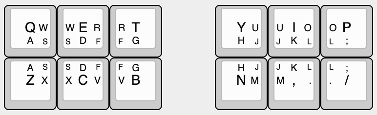
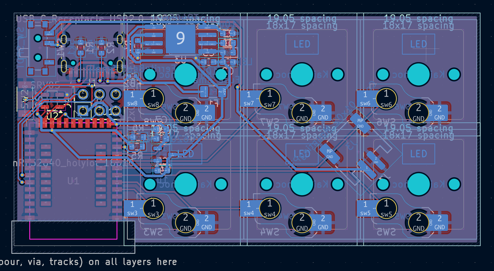

total time (so far): 27 hrs

# Journal of Changes
## 22 May 2025 - Keymap
Initial draft of the alpha layer (note: will probably not use qwerty because most frequently used letters should only require one keypress)

Explanation:
- Press Q for Q
- Press Q and Z for A
- Press Q, E, Z, and C for S

(a bit of a weird system but its kinda cool)

Time spent: 30 mins

## 24 May 2025 - Schematic
1st draft of the schematic - hoping it doesn't blow up :)

Time spent: 3 hrs

2nd draft - removed some unnecessary voltage sensing circuitry

Time spent: 1 hr

## 29 May 2025 - PCB Routing
@koeg on Slack has told me that my schematic is ok :)

Removed the really expensive debug connector and replaced it with a normal 6 pin ICSP header

Also routed the PCB

Time spent: 4.5 hrs

## 30 May 2025 - PCB Review, starting v2
@koeg has reviewed my PCB (tysm), added a ground and 5V plane, so restarted routing

Time spent: 3 hrs

## 31 May 2025 - PCB Review, v2
A new day, a new PCB iteration

Finished 2nd draft of PCB, awaiting review

Time spent: 3 hrs

## 1 June - 13 June 2025 - Exams (not an actual journal entry)
:|

## 13 June 2025 - PCB Review, v3
Finally back from exams, and I have a new PCB revision! Now using 2 layers instead of 4, which is much cheaper :). Also realised that I could put components behind the switches, so I did that. It is much smaller now.

Time spent: 4 hrs

## 16 June 2025 - PCB Review, v3.1, Case, BOM part 1
A few minor changes with routing, modelled the case, and started researching for parts to use in the BOM

Time spent: 5 hrs

## 17 June 2025 - BOM part 2
Added the rest of the BOM, and also added some links to parts that I will need to source myself
Also calculated the cost of the BOM, which is around $55 USD (excluding shipping)
(it took way too long to find the JST PH connectors)

Time spent: 3 hrs
