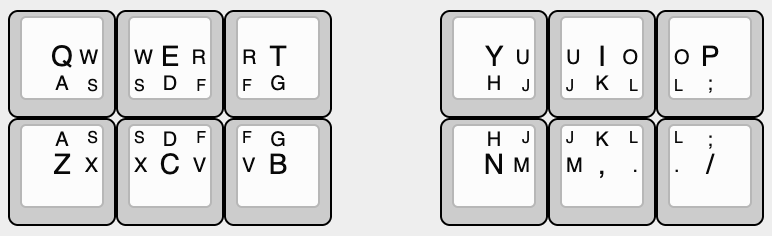
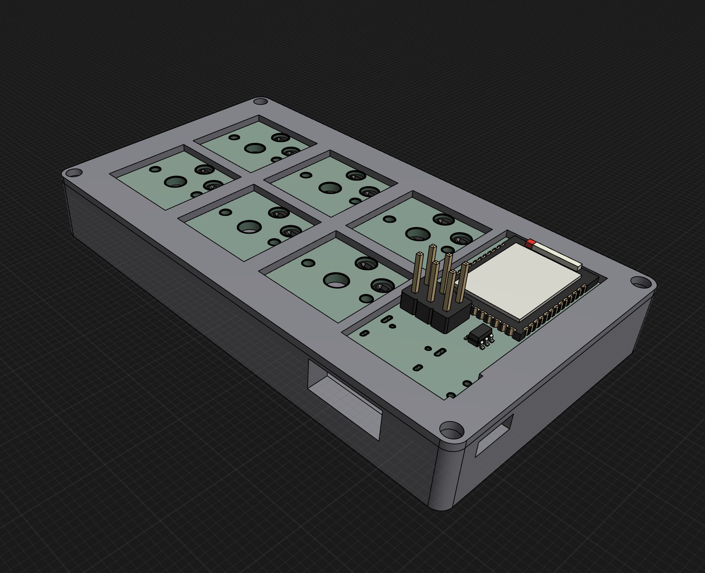
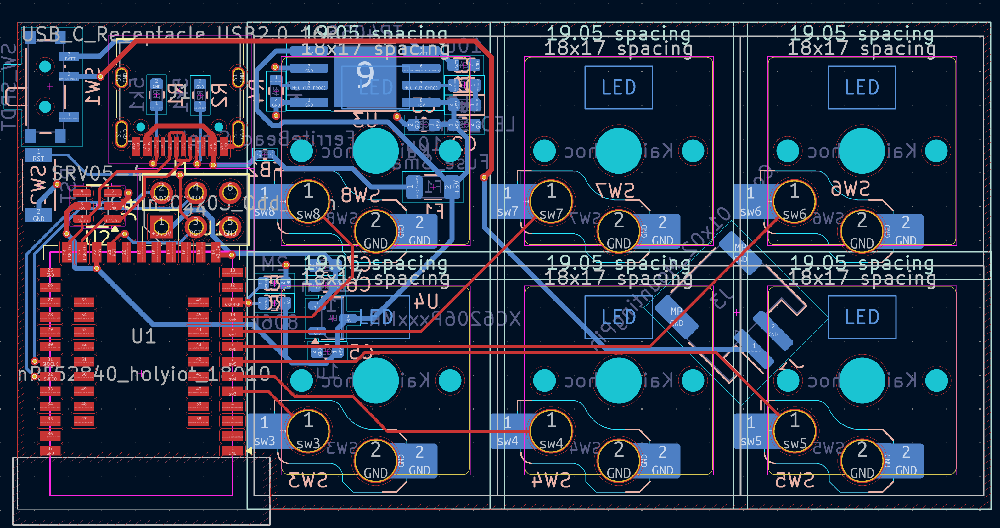

# idiot12-wireless
the idiot12, now in wireless form factor

(see [https://github.com/wenbang24/idiot17](https://github.com/wenbang24/idiot17) and [https://github.com/wenbang24/idiot12](https://github.com/wenbang24/idiot12) for context)
a wireless split keyboard with every alpha key fitting on one layer with 12 keys
uses holyiot 18010 nRF52840 module, USB-C charging, and Kailh Choc switches

# BOM
This is just for one side; double it for both sides.
|Designator                  |Footprint                                       |Quantity|Value                      |LCSC Part #|
|----------------------------|------------------------------------------------|--------|---------------------------|-----------|
|C2                          |0603                                            |1       |4u7                        |C19666     |
|C3, C4                      |0603                                            |2       |10u                        |C19702     |
|C5, C6                      |0603                                            |2       |1u                         |C15849     |
|C7                          |0603                                            |1       |100n                       |C14663     |
|D2                          |0603                                            |1       |LED_Small                  |C2286      |
|F1                          |1206                                            |1       |Fuse_Small                 |C151162    |
|FB2                         |0402                                            |1       |FerriteBead_Small          |C160976    |
|J1                          |USB_C_Receptacle_HRO_TYPE-C-31-M-12             |1       |USB_C_Receptacle_USB2.0_16P|C165948    |
|J3                          |JST_PH_S2B-PH-SM4-TB_1x02-1MP_P2.00mm_Horizontal|1       |Conn_01x02_MountingPin     |C295747    |
|J4                          |PinHeader_2x03_P2.54mm_Vertical                 |1       |Conn_02x03_Odd_Even        |C5116479   |
|R1, R2                      |0603                                            |2       |5k1                        |C23186     |
|R3                          |0603                                            |1       |1k5                        |C22843     |
|R4                          |0603                                            |1       |5k                         |C23186     |
|R5                          |0603                                            |1       |806k                       |C403362    |
|R6                          |0603                                            |1       |2M                         |C4077045   |
|SW1                         |SW_SPDT_PCM12                                   |1       |SW_SPDT                    |C221841    |
|SW2                         |TS-1088R-02526                                  |1       |RST                        |C720477    |
|SW3, SW4, SW5, SW6, SW7, SW8|SW_choc_v1_HS_CPG135001S30_1u                   |6       |Kailh_Choc                 |           |
|U1                          |nRF52840_holyiot_18010                          |1       |nRF52840_holyiot_18010     |           |
|U2                          |SOT-23-6                                        |1       |SRV05-4                    |C316033    |
|U3                          |SOP-8-1EP_4.57x4.57mm_P1.27mm_EP4.57x4.45mm     |1       |TP4056                     |C16581     |
|U4                          |SOT-23-3                                        |1       |XC6206PxxxMR               |C5446      |

## Parts to source yourself:
- Holyiot 18010 e.g. [this](https://www.aliexpress.com/item/32868002366.html?spm=a2g0o.productlist.main.2.74edNdM5NdM5Lu&algo_pvid=63543511-576a-4598-869e-381ab8d96dd6&algo_exp_id=63543511-576a-4598-869e-381ab8d96dd6-1&pdp_ext_f=%7B%22order%22%3A%228%22%2C%22eval%22%3A%221%22%7D&pdp_npi=4%40dis%21AUD%2110.59%2110.59%21%21%216.77%216.77%21%402103273e17500347440062660e8dd6%2112000030046383139%21sea%21AU%212685707787%21ACX&curPageLogUid=FLPTO15Lm8sv&utparam-url=scene%3Asearch%7Cquery_from%3A)
- USB-C receptacle (TYPE-C-31-M-12) e.g. [this](https://www.aliexpress.com/item/1005003285152827.html)
- SRV-05 e.g. [this](https://www.aliexpress.com/item/1005007499115687.html?spm=a2g0o.productlist.main.1.370c2eabRIuU4c&algo_pvid=3902107f-d815-4f71-892f-0f4ff5babd23&algo_exp_id=3902107f-d815-4f71-892f-0f4ff5babd23-0&pdp_ext_f=%7B%22order%22%3A%2263%22%2C%22eval%22%3A%221%22%7D&pdp_npi=4%40dis%21AUD%213.00%211.55%21%21%211.92%210.99%21%402101e7f617500346809515112e5430%2112000041034899345%21sea%21AU%212685707787%21ACX&curPageLogUid=wGPht6PxB6Zn&utparam-url=scene%3Asearch%7Cquery_from%3A)
- 2.54mm 2x3 pin header e.g. [this](https://www.aliexpress.com/item/4000303366348.html?spm=a2g0o.productlist.main.9.b9d0670dk3BV5M&algo_pvid=57cdfcc2-917a-4bc1-85a6-6d20830b449f&algo_exp_id=57cdfcc2-917a-4bc1-85a6-6d20830b449f-8&pdp_ext_f=%7B%22order%22%3A%2212%22%2C%22eval%22%3A%221%22%7D&pdp_npi=4%40dis%21AUD%211.91%211.55%21%21%211.22%210.99%21%402101eac917500339708216026e6416%2112000044746020817%21sea%21AU%212685707787%21ACX&curPageLogUid=530t4aMtfrUG&utparam-url=scene%3Asearch%7Cquery_from%3A)
- 3.7V LiPo battery (around 120mAh) with 2mm JST PH header e.g. [this](https://core-electronics.com.au/lipo-polymer-lithium-ion-battery-120mah.html)
- 4x M3 10mm screws e.g. [this](https://www.bunnings.com.au/pinnacle-m3-x-10mm-zinc-plated-round-head-bolts-and-nuts-20-pack_p0247262)
- 6x Kailh Choc switches e.g. [this](https://www.aliexpress.com/item/1005005883472162.html?spm=a2g0o.productlist.main.9.4860194bsF2axc&algo_pvid=96efd269-fd40-4912-bcc3-c3c9bf343ace&algo_exp_id=96efd269-fd40-4912-bcc3-c3c9bf343ace-8&pdp_ext_f=%7B%22order%22%3A%22513%22%2C%22eval%22%3A%221%22%7D&pdp_npi=4%40dis%21AUD%2129.31%2121.49%21%21%2118.73%2113.73%21%402101ea8c17500345939608243e6881%2112000034695877956%21sea%21AU%212685707787%21ACX&curPageLogUid=j4LjWbErE5Ol&utparam-url=scene%3Asearch%7Cquery_from%3A)
- 6x Kailh Choc keycaps e.g. [this](https://www.aliexpress.com/item/32949747794.html?spm=a2g0o.productlist.main.1.460d5999529yoW&algo_pvid=ede377b0-6f3c-4e11-a73a-7adab6daf68c&algo_exp_id=ede377b0-6f3c-4e11-a73a-7adab6daf68c-0&pdp_ext_f=%7B%22order%22%3A%224%22%2C%22eval%22%3A%221%22%7D&pdp_npi=4%40dis%21AUD%210.31%210.31%21%21%210.20%210.20%21%40210308a417500347822807759e1e9a%2166232934108%21sea%21AU%212685707787%21ACX&curPageLogUid=KRoYxvyJp5yq&utparam-url=scene%3Asearch%7Cquery_from%3A)

**Cost**: $49.73 USD (excluding shipping)
Estimated total: $55 USD
(prices converted from AUD to USD, accurate as of 2025-06-16)
